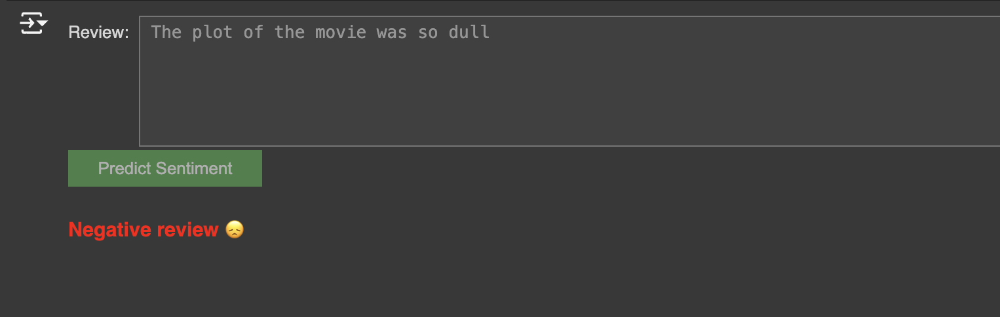

# 🎬 **IMDB Sentiment Analysis using NLP and Logistic Regression** 🎬

Welcome to the **Sentiment Analysis** project! This project uses **Natural Language Processing (NLP)** techniques and **Logistic Regression** to classify movie reviews from the **IMDB dataset** as either **positive** or **negative**. It's an exciting way to see how machine learning can analyze text and predict sentiment. 🌟

## 📜 **Project Overview**

The goal of this project is to build a machine learning model that can predict the **sentiment** (positive/negative) of a movie review using textual data. We use the **IMDB movie reviews dataset**, which contains 50,000 reviews labeled as **positive** or **negative**.

### Key Components:
- **Data Preprocessing**: Text cleaning (removing punctuation, stopwords, etc.) and tokenization.
- **TF-IDF Vectorization**: Converting the cleaned text into numerical form.
- **Model**: Training a **Logistic Regression** model to classify sentiment.
- **Evaluation**: Performance metrics using **accuracy**, **precision**, **recall**, and **confusion matrix**.
- **Interactive UI**: A simple interface where users can input a review and get instant sentiment predictions! 💡

## 🚀 **How to Run the Project**

1. **Clone the repository**:
    ```bash
    git clone https://github.com/UmmeKulsumTumpa/Sentiment-Analysis-IMDB-Movie-Reviews.git
    cd IMDB-Sentiment-Analysis
    ```
2. **Run the Jupyter Notebook**:
    - Launch the Jupyter Notebook and open `Sentiment_Analysis_IMDB.ipynb`.
    - Follow the steps inside the notebook to run the project end-to-end.

3. **Using the UI**:
    - After running the final cell, use the interactive UI to input your own movie review, and watch the model predict the sentiment with cute emoji feedback! 😊😞

## 🧰 **Project Structure**

```
📦IMDB-Sentiment-Analysis
 ┣ 📂Sentiment_Analysis_IMDB.ipynb    # Main Jupyter Notebook
 ┣ 📂IMDB Dataset.csv                 # Dataset used for training and testing
 ┣ 📂README.md                        # You're here!
```

## ⚙️ **Technologies Used**

- **Python** 🐍
- **Pandas**: For data manipulation.
- **Numpy**: For numerical operations.
- **NLTK**: For Natural Language Processing.
- **Scikit-learn**: For TF-IDF vectorization and model building.
- **Matplotlib & Seaborn**: For data visualization.
- **ipywidgets**: For creating a user-friendly input-output interface.

## 📊 **Results**

- **Accuracy**: Achieved **88%** accuracy in predicting whether a review is positive or negative.
- **Precision & Recall**: Balanced performance across both positive and negative reviews, demonstrating that the model generalizes well.

## 🖥️ **Screenshots**

1. **Confusion Matrix**:

   

2. **User Interface**:

   

## ✨ **Future Enhancements**

- **Explore Other Models**: Implement more advanced models like **LSTM** or **BERT** to improve prediction accuracy.
- **Deploy the Model**: Create a web application for real-time sentiment analysis using **Flask** or **Streamlit**.
- **Expand to Multilingual**: Extend sentiment analysis to reviews in other languages.

**Thank you for checking out this project! 🎬 I hope you find it insightful and fun.** 😄

